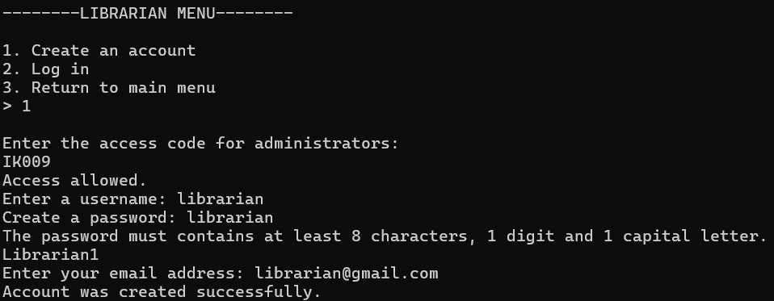
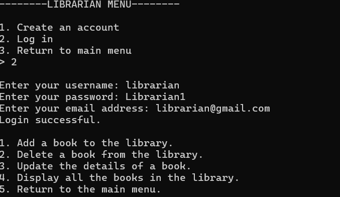
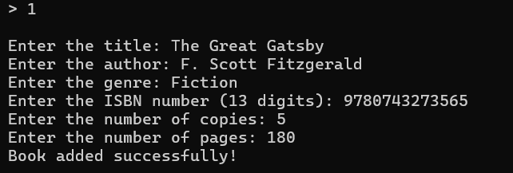
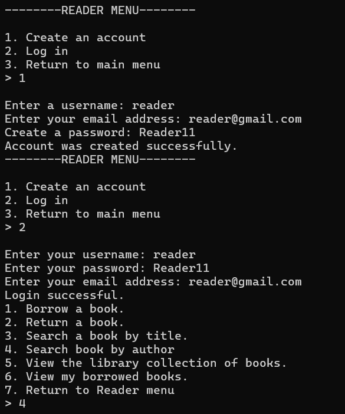
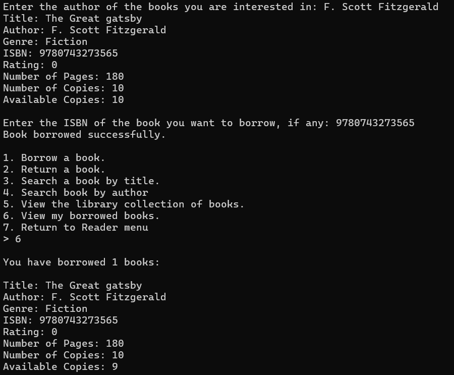
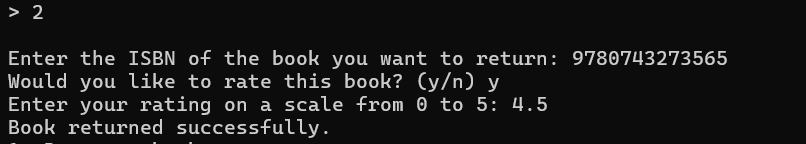
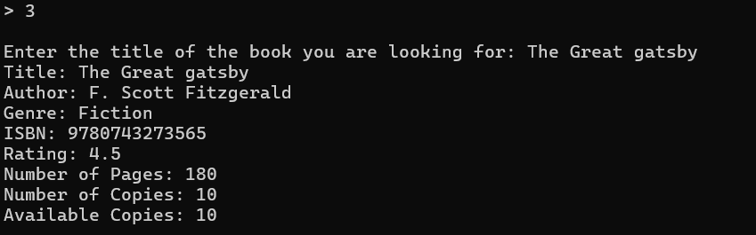
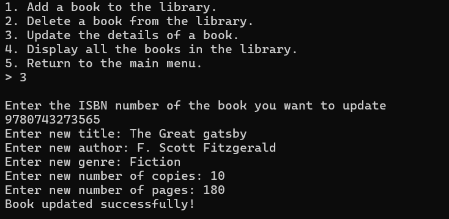

# Library Management System

A comprehensive C++ console application for managing library operations, designed to consolidate object-oriented programming concepts and file handling techniques.

## Table of Contents
- [Overview](#overview)
- [Features](#features)
- [Project Structure](#project-structure)
- [Getting Started](#getting-started)
- [Usage](#usage)
- [Use Cases & Walkthroughs](#use-cases--walkthroughs)
- [Classes and Components](#classes-and-components)
- [File Structure](#file-structure)
- [Technical Details](#technical-details)
- [Future Enhancements](#future-enhancements)

## Overview

This Library Management System is a console-based application built in C++ that simulates real-world library operations. The system supports two types of users: **Librarians** and **Readers**, each with distinct functionalities and permissions.

The project demonstrates key C++ concepts including:
- Object-Oriented Programming (OOP) principles
- Inheritance and Polymorphism
- File I/O operations
- STL containers and algorithms
- Memory management with dynamic allocation
- Template programming

## Features

### For Librarians
-  Add new books to the library collection
-  Delete books from the library
-  Update existing book details
-  View complete library collection
-  Manage book copies and availability

### For Readers
-  Search books by title or author
-  Borrow available books
-  Return borrowed books
-  Rate books (0-5 star rating system)
-  View personal borrowed books history
-  Browse entire library collection

### System Features
-  User authentication (separate for librarians and readers)
-  Account creation with validation
-  Persistent data storage in text files
-  Copy management system for multiple instances of books
-  Automatic ISBN validation and duplicate prevention
-  Book rating and review system

## Project Structure

```
LibraryManagementSem2/
├── include/                    # Header files
│   ├── models/                 # Data model headers
│   │   ├── Book.h             # Book class definition
│   │   ├── Borrowed_Book.h    # Borrowed book relationship
│   │   └── Copy.h             # Individual book copy management
│   ├── user/                  # User-related headers
│   │   ├── User.h             # Base user class
│   │   ├── Librarian.h        # Librarian-specific functionality
│   │   └── Reader.h           # Reader-specific functionality
│   └── utils/                 # Utility headers
│       ├── File_Management.h  # File I/O operations
│       ├── Functionality.h    # Menu and core functionality
│       └── Utility.h          # Helper functions and validation
├── src/                       # Source files
│   ├── LibraryManagementSystem.cpp  # Main entry point
│   ├── models/                # Data model implementations
│   ├── user/                  # User class implementations
│   └── utils/                 # Utility implementations
├── resources/                 # Data files
│   └── books.txt             # Book collection storage
└── LibraryManagementSystem/   # Visual Studio project files
```

## Getting Started

### Prerequisites
- C++ compiler with C++11 support or later
- Visual Studio 2019/2022 (recommended) or any compatible IDE
- Windows operating system (current configuration)

### Building the Project

1. **Clone the repository:**
   ```bash
   git clone https://github.com/mMelnic/LibraryManagementSem2.git
   cd LibraryManagementSem2
   ```

2. **Using Visual Studio:**
   - Open `LibraryManagementSystem/LibraryManagementSystem.sln`
   - Build the solution (Ctrl+Shift+B)
   - Run the project (F5)

3. **Using Command Line:**
   ```bash
   # Navigate to the project directory
   cd LibraryManagementSystem/x64/Debug/
   ./LibraryManagementSystem.exe
   ```

## Usage

Upon launching the application, you'll be presented with the main menu:

```
Welcome to the Library Management System

1. I am a librarian.
2. I am a reader.
3. Exit.
```

Each user type has distinct workflows and permissions within the system.

## Use Cases & Walkthroughs

### Use Case 1: Librarian Adding a New Book

**Scenario:** A librarian wants to add a new book "The Great Gatsby" by F. Scott Fitzgerald to the library collection.

**Steps:**
1. Launch the application
2. Select "1. I am a librarian"
3. Choose "2. Log in" (or create account if first time with access code IK009)
4. Enter librarian credentials
   




5. From librarian menu, select "1. Add a book to the library"
6. Enter book details:
   - Title: The Great Gatsby
   - Author: F. Scott Fitzgerald
   - Genre: Fiction
   - ISBN: 9780743273565 (system validates uniqueness)
   - Number of copies: 5
   - Number of pages: 180
7. System confirms: "Book added successfully!"
8. Book is automatically saved to the books.txt file

    
**Expected Outcome:** The book is added to the library collection with 5 available copies, each with a unique copy ID.

---

### Use Case 2: Reader Searching and Borrowing a Book

**Scenario:** A reader wants to find and borrow a book by their favorite author.

**Steps:**
1. Launch the application
2. Select "2. I am a reader"
3. Choose "2. Log in" or create new account
4. Enter reader credentials
   
    
5. From reader menu, select "4. Search book by author"
6. Enter author name: "F. Scott Fitzgerald"
7. System displays matching books with availability status
8. Select "1. Borrow a book"
9.  Enter ISBN of desired book: 9780743273565
10. Select "6. My borrowed books"
11. System confirms borrowing and updates availability

    

**Expected Outcome:** The book is added to the reader's borrowed books list, and one copy becomes unavailable.

---

### Use Case 3: Reader Returning and Rating a Book

**Scenario:** A reader has finished reading a borrowed book and wants to return it with a rating.

**Steps:**
1. Launch the application and log in as reader
2. Select "2. Return a book" from reader menu
3. Enter ISBN of the book to return
4. System prompts for rating (0-5 stars)
5. Enter rating: 4.5
6. System confirms return and updates book's average rating
   
    

7. Select "6. View my borrowed books" to verify removal or search for the book anew
   

**Expected Outcome:** Book is removed from borrowed list, copy becomes available, and book's rating is updated.

---

### Use Case 4: Librarian Updating Book Information

**Scenario:** A librarian needs to update the number of copies for a popular book due to new arrivals.

**Steps:**
1. Launch application and log in as librarian
2. Select "3. Update the details of a book"
3. Enter ISBN of book to update
4. Update details:
   - Keep title, author, genre the same
   - Increase number of copies from 5 to 10
   - Keep number of pages the same
5. System automatically creates 5 new copies with unique IDs
6. Confirmation: "Book updated successfully!"

   

**Expected Outcome:** Three additional copies are created and available for borrowing.

---

### Use Case 5: System Data Persistence

**Scenario:** Demonstrating how the system maintains data across sessions.

**Steps:**
1. Add several books as librarian
2. Borrow books as different readers
3. Close the application
4. Restart the application
5. Log in and verify all data is preserved:
   - Books remain in library collection
   - Borrowed books are still associated with readers
   - Copy availability status is maintained

**Expected Outcome:** All data persists correctly, demonstrating robust file management.

## Classes and Components

### Core Classes

- **User**: Base class for authentication and common operations
- **Librarian**: Inherits from User, manages library collection
- **Reader**: Inherits from User, handles borrowing and searching
- **Book**: Represents a book with metadata and copy management
- **Copy**: Individual instances of books with unique IDs
- **BorrowedBook**: Links readers with specific book copies

### Utility Classes

- **Utility**: Input validation and helper functions
- **File_Management**: Persistent storage operations
- **Functionality**: Menu systems and core application flow

## File Structure

The system uses text files for data persistence:

- **books.txt**: Stores complete book collection
- **reader_database.txt**: Reader credentials
- **librarian_database.txt**: Librarian credentials
- **borrowed_books.txt**: Readers and borrowed books
- **Data Format**: Custom serialization for objects

## Technical Details

### Memory Management
- Dynamic allocation for books and users
- Proper cleanup in destructors

### Design Patterns
- Inheritance hierarchy for user types
- Template functions for generic operations
- Separation of concerns across modules

### Validation Features
- ISBN format and uniqueness validation
- Password strength requirements
- Input sanitization and error handling

## Future Enhancements

Key areas for potential enhancement:

1. **Database Integration**: Replace text files with proper database
2. **GUI Interface**: Add graphical user interface
3. **Advanced Search**: Implement fuzzy search and filters
4. **Reporting**: Add library statistics and reports
5. **Security**: Enhance password encryption and user sessions

---

*This project demonstrates fundamental C++ programming concepts including OOP principles, file handling, STL usage, and memory management in a practical library management context.*
